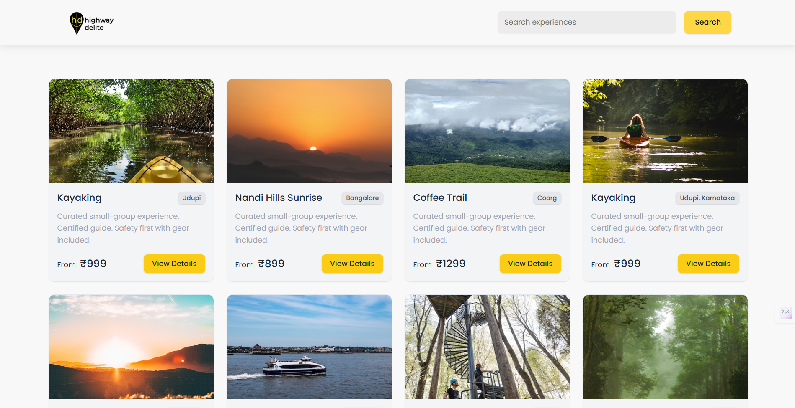
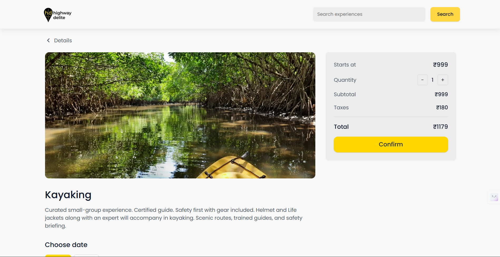
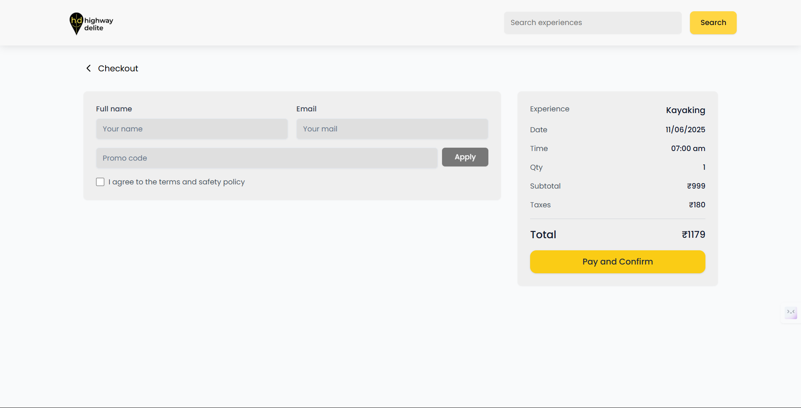
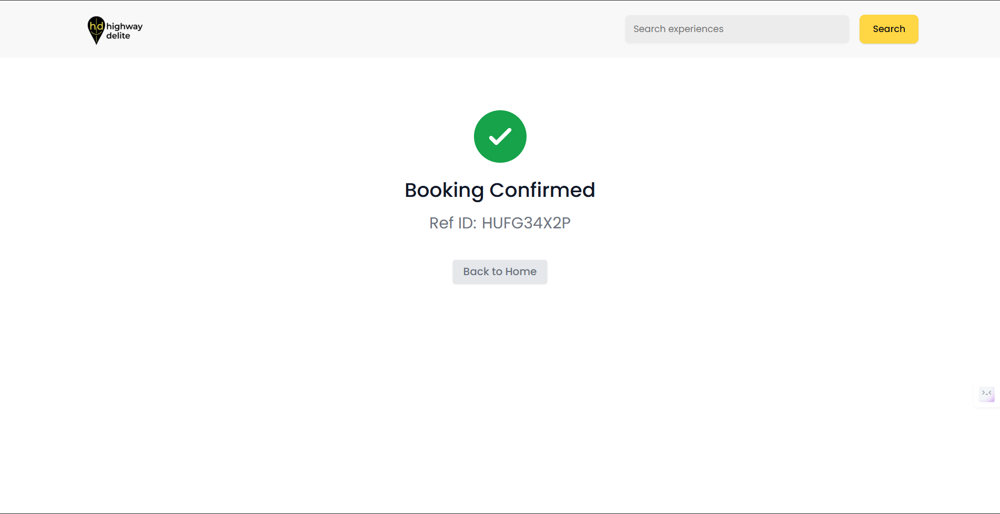

# BookIt Experiences & Slots

A modern web application for booking travel experiences with real-time slot availability. Users can explore various adventure activities, check available time slots, and complete secure bookings.

## ✨ Features

- 🏞️ Browse diverse travel experiences.
- 🔍 Search and filter experiences by name, location, and category.
- 📅 Real-time slot availability and booking.
- 💳 Secure checkout with promo code support.
- ✅ Booking confirmation with reference ID.

## 🚀 Tech Stack

### Frontend
- **React 18** with TypeScript
- **React Router** for navigation
- **Tailwind CSS** for styling
- **Axios** for API communication

### Backend
- **Node.js** with Express.js
- **MongoDB Atlas** for database
- **Mongoose** for ODM
- **CORS** enabled for cross-origin requests

## 🛠️ Setup Instructions

### Prerequisites
- Node.js (v16 or higher)
- MongoDB Atlas account (or local MongoDB)

### 1. Clone Repository
```bash
git clone https://github.com/siddardha003/BookIt-Experiences-Slots.git
cd BookIt-Experiences-Slots
```

### 2. Backend Setup
```bash
cd backend
npm install
```

Create `.env` file in backend directory:
```env
PORT=3001
NODE_ENV=development
MONGODB_URI=your_mongodb_connection_string
```

### 3. Frontend Setup
```bash
cd frontend
npm install
```

## 🏃‍♂️ Running the Application

### Start Backend Server
```bash
cd backend
npm run dev
```
Server runs on: `http://localhost:3001`

### Start Frontend Development Server
```bash
cd frontend
npm run dev
```
Application runs on: `http://localhost:5173`


## 📚 API Endpoints

- `GET /api/experiences` - Get all experiences (with search/filter)
- `GET /api/experiences/:id` - Get experience details with schedules
- `POST /api/bookings` - Create new booking
- `POST /api/promo/validate` - Validate promo code


## 📱 Application Pages

### 🏠 Home Page

*Browse and search available experiences with responsive card layout*

### 🔍 Experience Details

*View detailed information and available time slots for booking*

### 💳 Checkout Page

*Secure booking form with customer details and promo code support*

### ✅ Booking Confirmation

*Booking confirmation with reference ID and success message*


## 🗂️ Project Structure

```
BookIt-Experiences-Slots/
├── backend/
│   ├── db/
│   │   ├── connection.js      # MongoDB connection
│   │   └── models.js          # Database schemas
│   ├── routes/
│   │   ├── experiences.js     # Experience routes
│   │   ├── bookings.js        # Booking routes
│   │   └── promo.js           # Promo code routes
│   ├── index.js               # Server entry point
│   └── seed.js                # Database seeding
└── frontend/
    ├── src/
    │   ├── components/        # Reusable UI components
    │   ├── screens/           # Page components
    │   ├── hooks/             # Custom React hooks
    │   ├── services/          # API service functions
    │   └── lib/               # Utility functions
    └── public/                # Static assets and screenshots
```

**Built with ❤️ by [Siddardha Karumuri](https://github.com/siddardha003)**
